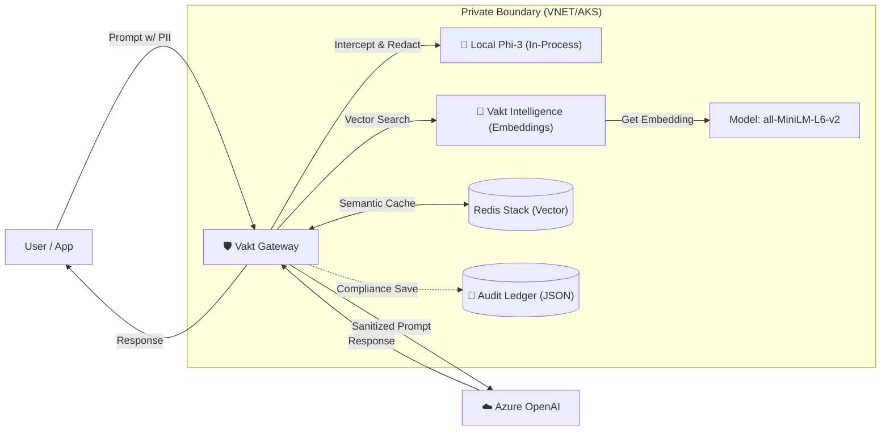

# Project Vakt 🛡️

> **Sovereign AI Gateway**: Unblock GenAI adoption in regulated industries by redacting PII locally before it touches the cloud.


> [!WARNING]
> **Experimental / Ideation Phase**: This project is a proof-of-concept and is **NOT** intended for production use. It is currently in the ideation phase to demonstrate Sovereign AI Gateway capabilities.

**Project Vakt** is an **Open Source Project** that provides a "Zero-Trust" gateway for Azure OpenAI. It uses **YARP** (Yet Another Reverse Proxy) and local Small Language Models (SLMs) like **Phi-3** to inspect and sanitize prompts within your private network boundary (VNET/Cluster) before forwarding them to public AI services.

## 🏗️ Architecture

The gateway sits between your applications and Azure OpenAI. It guarantees no PII (Personally Identifiable Information) leaves your infrastructure and reduces costs via Semantic Caching.



## 🚀 Features

- **Local PII Redaction**: Uses quantized Phi-3 Mini running on CPU (via ONNX Runtime) to detect and redact sensitive data.
- **True Semantic Caching**: Uses **Redis Stack** and `all-MiniLM-L6-v2` embeddings to cache responses for semantically similar prompts (>95% similarity), reducing cloud costs and latency.
- **Compliance Audit Logging**: Maintains an immutable local log (`audit.log`) of every PII modification event (Original vs Redacted).
- **Transparent Proxy**: Fully compatible with the Azure OpenAI API specification.
- **High Performance**: Built on .NET 8 and YARP for high-throughput forwarding.

## 🔌 Compatibility (1:1 Mapping)

Vakt is a **Drop-in Replacement** for Azure OpenAI. You do NOT need to change your SDKs or application logic.

**Before:**
```csharp
// Direct connection to Azure
OpenAIClient client = new(new Uri("https://my-resource.openai.azure.com/"), credential);
```

**After:**
```csharp
// Connection via Vakt (No other code changes needed)
OpenAIClient client = new(new Uri("http://localhost:5000/"), credential);
```

👉 **[See the Developer Integration Guide](docs/developer-guide.md)** for detailed Python (LangChain) and C# examples.

## 🏁 Quickstart

### 1. 🐳 Try Locally (Docker)
For non-developers or quick demos, use the pre-built Docker setup:
1.  Go to `deploy/docker`.
2.  Run `docker-compose up -d`.
3.  Access the Proxy at `http://localhost:5000`.

### 2. 👩‍💻 Develop (.NET Aspire)
For developers contributing to Vakt:
```bash
git clone https://github.com/digvijay/Vakt.git
dotnet run --project src/ProjectVakt.AppHost
```
This launches the **Aspire Dashboard**, offering full observability, traces, and a "Simulate Attack" button.

### 3. ☁️ Deploy to Azure
Provision infrastructure (Container Apps, Redis, Storage) and deploy in one click:

[](https://portal.azure.com/#create/Microsoft.Template/uri/https%3A%2F%2Fraw.githubusercontent.com%2Fdigvijay%2FVakt%2Fmaster%2Fdeploy%2Fazuredeploy.json)
*(Note: Requires `azure-dev.yml` pipeline setup or `azd up` locally)*

```bash
azd init -t digvijay/Vakt
azd up
```

## 🛠️ Vakt CLI

Manage models and test redaction locally without running the web stack.

```bash
# Install tool (once packaged)
dotnet tool install --global Vakt.CLI

# Commands
vakt download                  # Pre-download models to ~/.cache
vakt redact "My SSN is 1234"   # Test the Phi-3 redaction logic
```

## 📜 Audit Logging

Vakt automatically logs all PII modifications for compliance.
- **Location**: `audit.log` (in running directory, or configured path).
- **Format**: Newline-delimited JSON.

**Configuration (`appsettings.json`):**
```json
"Audit": {
  "Enabled": true,
  "LogPath": "/var/log/vakt/audit.log"
}
```

## ❓ Troubleshooting

### Common Issues

1.  **"FT.CREATE" / "unknown command" Error**:
    *   **Cause**: You are running a standard Redis instance, not Redis Stack.
    *   **Fix**: Ensure you use `redis/redis-stack-server`. If using `docker-compose`, checking your image tag.

2.  **Slow Startup / Timeouts**:
    *   **Cause**: On the first run, `vakt-intelligence` downloads ~2GB of models (Phi-3 + Embeddings). This depends on your internet speed.
    *   **Fix**: Check the container logs: `docker logs vakt-intelligence`. You should see download progress.

3.  **Open WebUI "Model Not Found"**:
    *   **Cause**: Connection to Vakt Proxy failed or API Key missing.
    *   **Fix**: Ensure `OPENAI_API_BASE_URL` is `http://vakt-proxy` (internal Docker network) or `http://localhost:5000` (host), and `OPENAI_API_KEY` is set to any non-empty value.

4.  **Azure OpenAI 401 Unauthorized**:
    *   **Cause**: The Proxy isn't injecting the key correctly or the key is invalid.
    *   **Fix**: Verify your `dotnet user-secrets` configuration for `AzureOpenAI:Key` in `src/Vakt.Proxy`.

## 🤝 Contributing

We welcome contributions! Please see [CONTRIBUTING.md](CONTRIBUTING.md) for details on how to get started.

## 🔒 Security

Security is our top priority. If you discover a security vulnerability, please see [SECURITY.md](SECURITY.md) for reporting guidelines.

## 📄 License

This project is licensed under the [MIT License](LICENSE).
