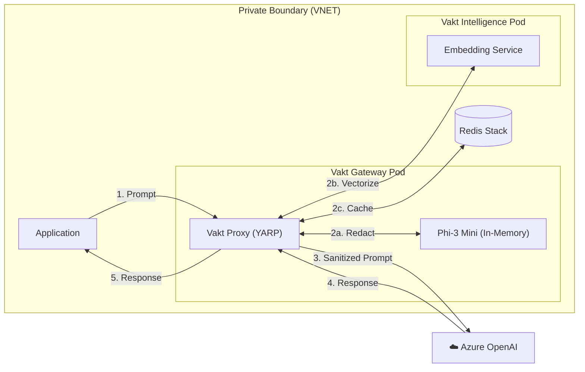

# Technical Whitepaper: Building a Zero-Trust AI Gateway

**Project Vakt** is an open-source reference implementation of a Sovereign AI Gateway, built on the .NET 8 stack. It combines high-performance reverse proxying with local Generative AI to create a self-contained guardrail system.

## Architecture

The solution follows the **Sidecar Pattern**, deployable to Azure Kubernetes Service (AKS) or Azure Container Apps (ACA).



## Technology Stack

### 1. The Proxy: YARP (.NET 8)
Vakt utilizes **YARP (Yet Another Reverse Proxy)** for reliable, high-throughput request forwarding. It acts as a **Transparent Proxy**, preserving all HTTP headers, methods, and body structures. This ensures 100% compatibility with existing Azure OpenAI SDKs (C#, Python, JavaScript, LangChain).

### 2. The Brain: Hybrid Intelligence
Vakt employs a hybrid approach for maximum performance:
*   **Redaction (In-Process)**: `Phi-3 Mini` runs inside the Proxy process using `Microsoft.ML.OnnxRuntimeGenAI`. This minimizes latency for the critical path of every request.
*   **Embeddings (Sidecar)**: A dedicated microservice (`Vakt.Intelligence`) handles vector embedding generation using `all-MiniLM-L6-v2`. This separates the concerns of Semantic Caching from Redaction.

### 3. The Logic: SovereignTransform
Custom middleware intercepts the HTTP body stream. 
```csharp
// Simplified Logic
public async Task ApplyAsync(HttpContext context)
{
    var originalPrompt = await ReadBodyAsync(context);
    var redactor = context.RequestServices.GetRequiredService<IIntelligenceService>();
    
    // Local Redaction
    var safePrompt = redactor.RedactPii(originalPrompt);
    
    if (safePrompt != originalPrompt)
    {
        // Rewrite request body before forwarding
        await WriteBodyAsync(context, safePrompt);
    }
}
```

## Deployment & Scalability

Project Vakt is designed to be **Cloud-Native**:
- **Stateless**: The proxy can scale horizontally (HPA) based on CPU/Memory usage.
- **Sidecar Capable**: Can run as a sidecar to the main application for 0-network-hop latency.
- **Model Management**: Models are downloaded at build/release time or mounted via Volume to keep container images slim.

## Security Considerations

- **No Egress**: The Phi-3 model requires no internet connection to run.
- **Memory Safety**: .NET 8 provides strong memory safety guarantees.
- **Supply Chain**: All dependencies are nuget-managed with strict versioning (Central Package Management).

## Future Roadmap

- **Audit Logging**: Immutable ledger of "Original vs Redacted" prompts for compliance auditing.
- **Multi-Model Support**: Configuration to swap Phi-3 for other SLMs (Llama-3, Mistral) based on use case.
